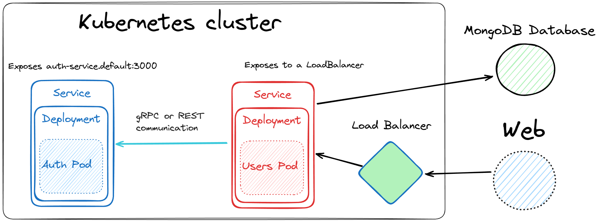

# Authentication microservice with kubernetes deployment



This is a authentication microservice project it's divided in two separated internal services that communicate with each other and a external mongo database, the internal services is:

## Auth-api

Auth api is responsible for handling tree authentication tasks which are in the following routes:

- **/hashed-pw/:password** this route accepds a password and return it's hashed counterpart.
- **/token** compare if a hashed password and an unhashed password are the same, and then returns a JWT token.
- **/verify-token** Verifying if a JWT token is valid.

## Users-api

It's responsible for handling users authentication requests from the web, it have the following apis:

- **/signup** it receives a email and a password, then it validate the credentials and call the **/hash-pw** from the auth-api, after that the it's saved in the mongodb the email and hashed password

- **/login** it queries the hashed password from the user email and then calls **/token** to verify if the password if valid and returns the JWT token.

## About the deployment

Both microservices was containerized with docker, and pushed to docker hub. Then the kubernetes definitions orchestrate the microservices for easy deployment in a cluster.

## Environment variables

```
MONGODB_CONNECTION_URI: for mongodb database

AUTH_API_ADDRESS: internal address for the auth microservice

TOKEN_KEY: token for JWT encryption
```
